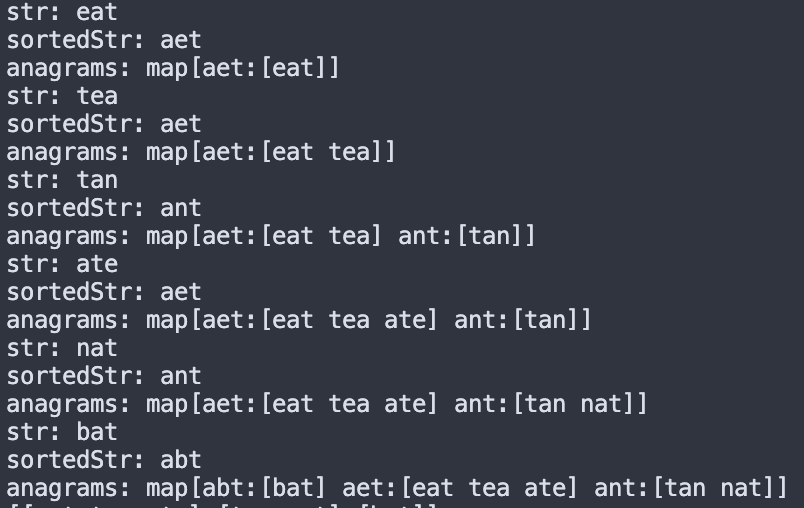

# 49. Group Anagrams

> Given an array of strings strs, group the anagrams together. You can return the answer in any order.
> An Anagram is a word or phrase formed by rearranging the letters of a different word or phrase, typically using all the original letters exactly once.

```go
func sortString(s string) string {
	runes := []rune(s)
	sort.Slice(runes, func(i, j int) bool { return runes[i] < runes[j] })
	return string(runes)
}

func groupAnagrams(strs []string) [][]string {
	anagrams := make(map[string][]string)

	for _, str := range strs {
		sortedStr := sortString(str)

		anagrams[sortedStr] = append(anagrams[sortedStr], str)
	}

	result := make([][]string, 0, len(anagrams))
	for _, group := range anagrams {
		result = append(result, group)
	}

	return result
}
```

```go
anagrams := make(map[string][]string)
```

1. 아나그램을 키로 삼고 value는 그 아나그램을 가진 문자열 배열이 되는 map을 만듭니다.

```go
func sortString(s string) string {
	runes := []rune(s)
	sort.Slice(runes, func(i, j int) bool { return runes[i] < runes[j] })
	return string(runes)
}

// groupAnagrams
for _, str := range strs {
    sortedStr := sortString(str)

    anagrams[sortedStr] = append(anagrams[sortedStr], str)
}
```

2. 각 문자열을 정렬하면 같은 anagram은 같은 문자열이 나오는데, 이걸 키로 삼고 배열에 넣습니다.
   > "ant" -> "ant", "tan" -> "ant"
   > 

```go
result := make([][]string, 0, len(anagrams))
for _, group := range anagrams {
    result = append(result, group)
}

return result
```

3. anagram을 2중 배열로 다시 만들어줍니다.
